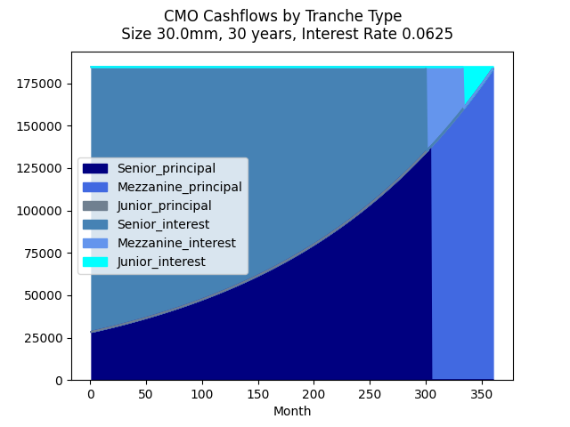

# CollateralizedMortgageObligationWaterfall

A Collateralized Mortgage Obligation (CMO) is a Structured Product that consists of a pool of mortgages separated into different tranches according to seniority.  CMOs largely exist in the US but there are similar examples in other countries.  In this example the Senior tranche sits at the top.  This recieves the principal and interest payments from the mortgage holders until the point that it becomes 'full' and then these are passed to the Mezzanine tranche which takes the rest of the principal and interest payments until full, and then the Junior tranche recieves the remainder.  The chart below shows how this 'Waterfall' process looks like over the life of the mortgage pool which is this case is 30 years or 360 months.

This example assumes there are no defaults from the mortage holders and no early prepayments although these features may be added in a future version.  Typically, these are absorbed in reverse, starting with the Junior tranche to protect the more senior tranches and the price the Junior tranche trades at relative to the other tranches, reflects this additional risk.

